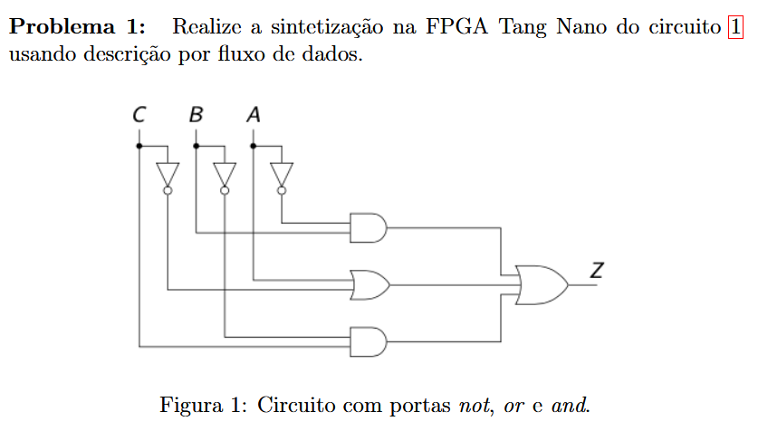
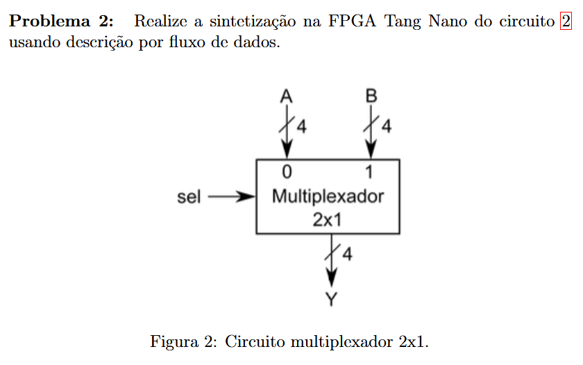
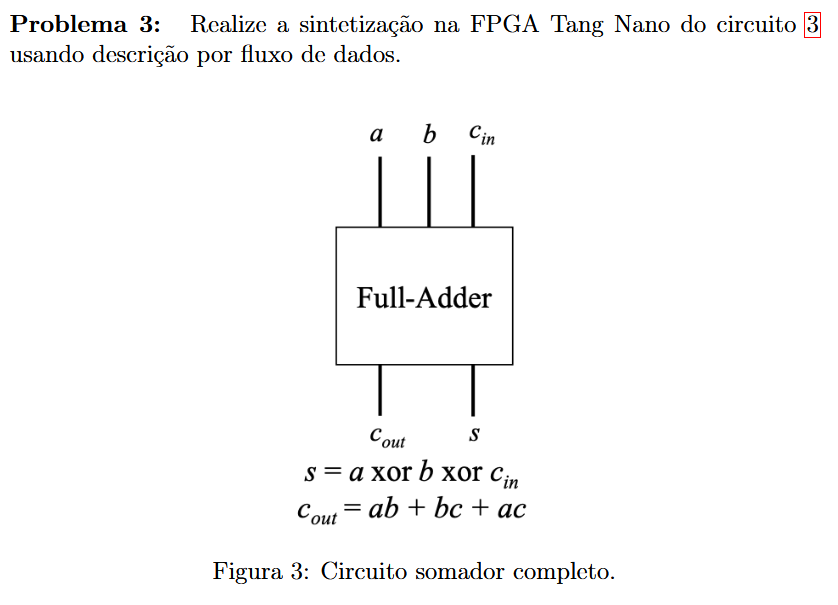
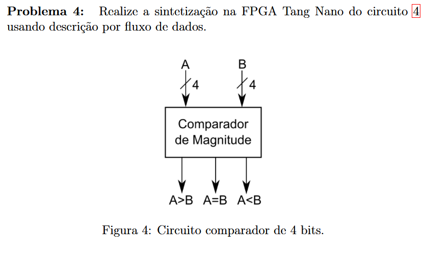

# Lista de Exercícios — Verilog (Fluxo de dados) na FPGA Tang Nano

## Convenções utilizadas

- `0`: nível lógico baixo.
- `1`: nível lógico alto.
- `~`: operação NOT.
- `&`: operação AND.
- `|`: operação OR.
- `^`: operação XOR.
- `[3:0]`: barramento de 4 bits.
- As tabelas apresentam o comportamento lógico do circuito, independentemente da polaridade dos LEDs usados na placa.

---

# Problema 1 — Circuito com portas NOT, AND e OR



## Entradas e saída

| Sinal | Tipo | Descrição |
|---|---|---|
| `A` | Entrada de 1 bit | Primeira entrada lógica |
| `B` | Entrada de 1 bit | Segunda entrada lógica |
| `C` | Entrada de 1 bit | Terceira entrada lógica |
| `Z` | Saída de 1 bit | Resultado da expressão lógica |

A equação correspondente é:

$$ Z = \overline{A}B + (A + \overline{C}) + \overline{B}C $$


## Tabela-verdade

| `A` | `B` | `C` | `~A & B` | `A \| ~C` | `~B & C` | `Z` |
|:---:|:---:|:---:|:---:|:---:|:---:|:---:|
| 0 | 0 | 0 | 0 | 1 | 0 | **1** |
| 0 | 0 | 1 | 0 | 0 | 1 | **1** |
| 0 | 1 | 0 | 1 | 1 | 0 | **1** |
| 0 | 1 | 1 | 1 | 0 | 0 | **1** |
| 1 | 0 | 0 | 0 | 1 | 0 | **1** |
| 1 | 0 | 1 | 0 | 1 | 1 | **1** |
| 1 | 1 | 0 | 0 | 1 | 0 | **1** |
| 1 | 1 | 1 | 0 | 1 | 0 | **1** |

---

# Problema 2 — Multiplexador 2×1 de 4 bits



## Entradas e saída

| Sinal | Tipo | Descrição |
|---|---|---|
| `A[3:0]` | Entrada de 4 bits | Primeiro dado de entrada |
| `B[3:0]` | Entrada de 4 bits | Segundo dado de entrada |
| `S` | Entrada de 1 bit | Sinal de seleção |
| `Y[3:0]` | Saída de 4 bits | Dado selecionado |

A saída é definida por:

```verilog
assign Y = S ? B : A;
```

O operador ternário possui a forma:

```text
condição ? valor_se_verdadeiro : valor_se_falso
```

Assim:

- quando `S = 0`, a saída recebe `A`;
- quando `S = 1`, a saída recebe `B`.

## Tabela funcional do barramento

| `S` | Saída `Y[3:0]` | Operação |
|:---:|:---:|---|
| 0 | `A[3:0]` | Seleciona a entrada `A` |
| 1 | `B[3:0]` | Seleciona a entrada `B` |

## Tabela-verdade de cada bit

O mesmo comportamento é aplicado separadamente aos quatro bits. Para qualquer posição `i`, em que `i` pode ser `0`, `1`, `2` ou `3`:

$$ Y_i = \overline{S}A_i + SB_i $$

| `A[i]` | `B[i]` | `S` | `Y[i]` |
|:---:|:---:|:---:|:---:|
| 0 | 0 | 0 | 0 |
| 0 | 1 | 0 | 0 |
| 1 | 0 | 0 | 1 |
| 1 | 1 | 0 | 1 |
| 0 | 0 | 1 | 0 |
| 0 | 1 | 1 | 1 |
| 1 | 0 | 1 | 0 |
| 1 | 1 | 1 | 1 |


# Problema 3 — Somador completo



## Entradas e saídas

| Sinal | Tipo | Descrição |
|---|---|---|
| `A` | Entrada de 1 bit | Primeiro bit da soma |
| `B` | Entrada de 1 bit | Segundo bit da soma |
| `Cin` | Entrada de 1 bit | Carry de entrada |
| `S` | Saída de 1 bit | Bit de soma |
| `Cout` | Saída de 1 bit | Carry de saída |

As equações do somador completo são:

$$ S = A \oplus B \oplus C_{in} $$

$$ C_{out} = AB + AC_{in} + BC_{in} $$

Em Verilog:

```verilog
assign S    = A ^ B ^ Cin;
assign Cout = (A & B) | (A & Cin) | (B & Cin);
```

A saída `S` fica em nível lógico `1` quando existe uma quantidade ímpar de entradas iguais a `1`.

A saída `Cout` fica em nível lógico `1` quando pelo menos duas das três entradas estão em nível lógico `1`.

## Tabela-verdade

| `A` | `B` | `Cin` | Soma decimal | `Cout` | `S` |
|:---:|:---:|:---:|:---:|:---:|:---:|
| 0 | 0 | 0 | 0 | 0 | 0 |
| 0 | 0 | 1 | 1 | 0 | 1 |
| 0 | 1 | 0 | 1 | 0 | 1 |
| 0 | 1 | 1 | 2 | 1 | 0 |
| 1 | 0 | 0 | 1 | 0 | 1 |
| 1 | 0 | 1 | 2 | 1 | 0 |
| 1 | 1 | 0 | 2 | 1 | 0 |
| 1 | 1 | 1 | 3 | 1 | 1 |

As duas saídas formam o resultado binário de 2 bits:

$$ \text{resultado} = \{Cout,S\} $$


# Problema 4 — Comparador de magnitude de 4 bits


## Entradas e saídas

| Sinal | Tipo | Descrição |
|---|---|---|
| `A[3:0]` | Entrada de 4 bits | Primeiro número binário |
| `B[3:0]` | Entrada de 4 bits | Segundo número binário |
| `A_maior_B` | Saída de 1 bit | Indica que `A > B` |
| `A_igual_B` | Saída de 1 bit | Indica que `A = B` |
| `A_menor_B` | Saída de 1 bit | Indica que `A < B` |

As entradas `A` e `B` representam valores binários sem sinal entre `0` e `15`.

Em Verilog:

```verilog
assign A_maior_B = A > B;
assign A_igual_B = A == B;
assign A_menor_B = A < B;
```

Somente uma das três saídas deve ficar em nível lógico `1` para cada comparação.

## Tabela-verdade funcional

| Relação entre as entradas | `A_maior_B` | `A_igual_B` | `A_menor_B` |
|---|:---:|:---:|:---:|
| `A > B` | 1 | 0 | 0 |
| `A = B` | 0 | 1 | 0 |
| `A < B` | 0 | 0 | 1 |

Uma tabela completa com todas as combinações de dois números de 4 bits teria:

$$ 16 \times 16 = 256 $$

combinações. A tabela funcional acima representa completamente o comportamento das três saídas, pois elas dependem apenas da relação entre `A` e `B`.
