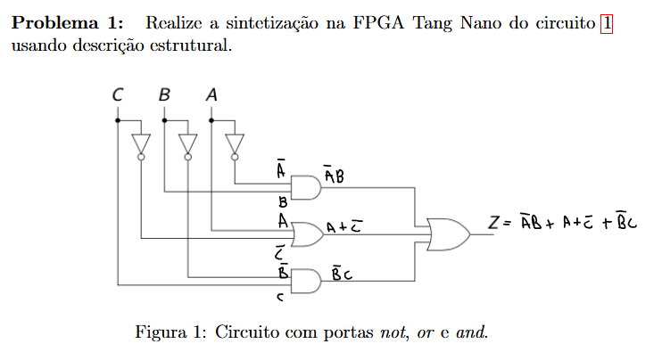
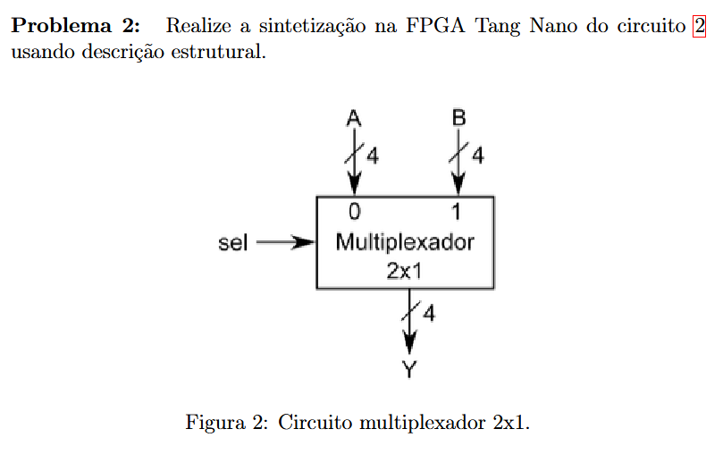
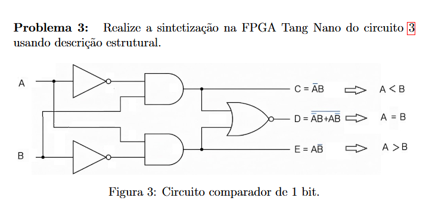

# Lista de Exercícios — Verilog Descrição Estrutural na FPGA Tang Nano

Resoluções elaboradas de acordo com o material **Hardware Description Language (HDL)**, de Petrúcio Ricardo Tavares de Medeiros (UFERSA).

Os circuitos são descritos por meio de:

- declaração das portas após o cabeçalho do módulo;
- sinais intermediários do tipo `wire`;
- primitivas lógicas do Verilog, como `not`, `and`, `or` e `nor`;
- instanciação no formato:

```verilog
<primitiva> nome_instancia (saida, entradas);
```

---

## Problema 1 — Circuito com portas NOT, AND e OR



### Função lógica

A partir do circuito apresentado:

$$Z = \overline{A}B + (A + \overline{C}) + \overline{B}C$$

### Tabela-verdade

| A | B | C | Z |
|---:|---:|---:|---:|
| 0 | 0 | 0 | 1 |
| 0 | 0 | 1 | 1 |
| 0 | 1 | 0 | 1 |
| 0 | 1 | 1 | 1 |
| 1 | 0 | 0 | 1 |
| 1 | 0 | 1 | 1 |
| 1 | 1 | 0 | 1 |
| 1 | 1 | 1 | 1 |


## Problema 2 — Multiplexador 2×1 de 4 bits



O circuito possui:

- duas entradas de 4 bits: `A` e `B`;
- uma entrada de seleção: `sel`;
- uma saída de 4 bits: `Y`.

### Funcionamento

Quando `sel = 0`:

$$Y = A$$

Quando `sel = 1`:

$$Y = B$$

Para cada bit do barramento:

$$Y_i = A_i\overline{sel} + B_i sel$$

com \(i = 0,1,2,3\).

### Tabela de funcionamento

| `sel` | Saída |
|---:|---|
| 0 | `Y = A` |
| 1 | `Y = B` |

### Exemplo

Para:

```text
A = 1010
B = 0111
```

Quando `sel = 0`:

```text
Y = 1010
```

Quando `sel = 1`:

```text
Y = 0111
```

## Problema 3 — Comparador de 1 bit



O circuito compara duas entradas de 1 bit, `A` e `B`, e possui três saídas:

- `C = 1` quando \(A < B\);
- `D = 1` quando \(A = B\);
- `E = 1` quando \(A > B\).

### Funções lógicas

#### Saída correspondente a \(A < B\)

$$C = \overline{A}B$$

#### Saída correspondente a \(A = B\)

$$
D = \overline{\overline{A}B + A\overline{B}}
$$

#### Saída correspondente a \(A > B\)

$$E = A\overline{B}$$


### Tabela-verdade

| A | B | C — \(A<B\) | D — \(A=B\) | E — \(A>B\) |
|---:|---:|---:|---:|---:|
| 0 | 0 | 0 | 1 | 0 |
| 0 | 1 | 1 | 0 | 0 |
| 1 | 0 | 0 | 0 | 1 |
| 1 | 1 | 0 | 1 | 0 |

